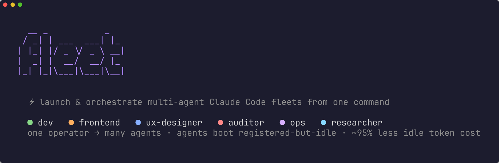
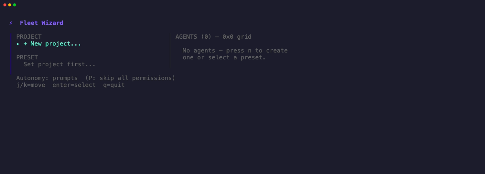

<p align="center">
  
</p>

[](https://github.com/zairedegrees/fleet/actions/workflows/ci.yml)
[](https://pkg.go.dev/github.com/zairedegrees/fleet)
[](https://github.com/zairedegrees/fleet/releases)

**Launch and orchestrate multi-agent Claude Code fleets from one command.**

`fleet` is a Go CLI and TUI that spins up a team of Claude Code agents, each in its own tmux session, lays them out in an iTerm2 grid, and coordinates them through a built-in MCP coordination core (no separate relay to install). One operator drives many agents: dispatch a task to any agent, stream its terminal, add or stop workers on the fly.





```bash
fleet                          # interactive wizard: pick a project, a team, launch
fleet dispatch "fix the failing auth test" --to auditor
fleet logs dev -f              # follow an agent's terminal
fleet --status                 # readable status: who's idle vs working, and how long since seen
```

## Why

Running a fleet of always-on agents is expensive. A common but naive pattern — an agent that polls for work every 30 seconds — burns tokens around the clock even when there is nothing to do. A real "check inbox, nothing to do" turn is not cheap: measured across dozens of real idle turns, the median is **~59k tokens (~$0.06 at current Opus rates)** — mostly cached context re-read on every poll. At one poll every 30s that is roughly **$180/day per idle agent**, about **$1,000/day for a team of six** — spent doing nothing.

fleet treats tokens as the scarce resource:

- Agents boot **registered but idle**: the tmux session is live and Claude is ready, but no polling loop runs. **Idle cost: zero tokens.**
- fleet **registers each agent server-side** at launch (full identity: role, `profile_slug`, reporting line). Agents never self-register in their pane, so they can't accidentally wipe their own `profile_slug` — task routing keeps working regardless of relay version. Identity travels with the wake instead.
- fleet **wakes an agent on dispatch**. The talk loop starts only when there is a task, then dies on its own after a few empty checks.
- Net effect: agents spend tokens **while working, not while waiting**. An idle fleet runs no polling loop at all, so against that always-polling baseline its idle cost is **effectively zero** — the whole idle bill avoided, not a slice of it (a transcript-based measurement puts it at **>99%**).

## Features

- **Interactive wizard** (Bubble Tea TUI): pick a project, point at a path, confirm the relay URL (validated on the spot, defaults to the local relay), pick a team, launch.
- **Stack scanner**: detects the project's tech stack and suggests matching agent roles.
- **10 team presets**: Web App, API / Backend, Data / ML, Trading Bot, Full Stack, Minimal, Solo Pair, Design Studio, Security Hardening, Custom. Each is a ready-made set of agents with roles, models, and a reporting structure.
- **Per-agent behavioral config**: each agent carries its own model, persona, skills, tool scope, and permission mode. An agent whose name matches a known role (`dev`, `auditor`, `ops`, `frontend`, …) gets a ready-made persona at launch — no config needed.
- **tmux session per agent**, opened together in an **iTerm2 grid** (falls back to `tmux attach`).
- **Task dispatch + wake** in one step, routed through the relay.
- **Live logs**: stream any agent's pane, follow mode polls once a second.
- **Readable status**: `fleet --status` shows each agent's derived state (idle / working), posture, and last-seen — with a legend — instead of a raw registration flag.
- **Runtime fleet management**: `add` and `stop` agents without restarting the team.
- **Doctor**: checks tmux, the Claude Code CLI, iTerm2, and the relay, with install hints.
- **Persistent config**: every launch is saved as TOML, relaunch with `fleet --last`.

## Install

**Install script** (macOS & Linux):

```bash
curl -fsSL https://raw.githubusercontent.com/zairedegrees/fleet/main/scripts/install.sh | sh
```

**Go toolchain** (any platform):

```bash
go install github.com/zairedegrees/fleet/cmd/fleet@latest
```

Or build from source:

```bash
git clone https://github.com/zairedegrees/fleet
cd fleet
go build -o fleet ./cmd/fleet
```

> Grabbed a release archive from your browser instead? macOS may quarantine it — clear the flag with `xattr -d com.apple.quarantine ./fleet`. (The install script does this for you.)

### Onboarding skill

If you use Claude Code, install the bundled `/fleet` skill — it drives the whole first-run setup (prerequisites, relay, a tailored team, launch):

```bash
ln -s "$(pwd)/skill/fleet" ~/.claude/skills/fleet
```

Then in Claude Code say "set up fleet for this project" (or `/fleet`) and it walks you from zero to a running, registered fleet.

## Requirements

Run `fleet --doctor` to verify and get install hints.

| Tool | Purpose | Install |
| --- | --- | --- |
| tmux | one session per agent | `brew install tmux` |
| Claude Code CLI | the agents themselves | `npm install -g @anthropic-ai/claude-code` |
| iTerm2 | grid layout (optional, falls back to tmux) | `brew install --cask iterm2` |
| coordination core | agent registry, profiles, task dispatch | built into fleet (native, MIT) |

### The coordination core (built in)

fleet ships its own coordination core — `internal/coord`, a small MCP-over-HTTP server backed by pure-Go SQLite (no CGO) — and starts it on `localhost:8090` automatically. There's nothing to install, download, or consent to: it's compiled into the binary and runs as a detached child that outlives the launch. Manage it with `fleet relay start|stop|status`, or point at an external relay with `fleet --relay-url <url>`.

coord is an independent MIT reimplementation of the [wrai.th](https://github.com/Synergix-lab/WRAI.TH) relay's MCP wire contract — same endpoint, same tools — written from the wire behavior, not its source. The AGPL `agent-relay` binary therefore stays available as an opt-in fallback: `fleet --relay-backend download` (or `FLEET_RELAY_BACKEND=download`) downloads and runs it, with consent, from wrai.th's releases.

> **Licensing:** coord and the bundled `/relay` skill are MIT and ship in this repo. fleet bundles no AGPL code; the AGPL `agent-relay` is only ever downloaded on your behalf when you explicitly opt into the `download` backend.

> **Re-registration safety:** fleet registers each agent server-side at launch and agents never self-register, so an agent can't wipe its own `profile_slug` and break task routing. coord also preserves omitted identity fields on any re-register.

## Usage

```bash
fleet                         # interactive wizard
fleet --demo                  # try it with zero setup: a simulated fleet in the live status view
fleet --last                  # relaunch the last saved fleet
fleet --status                # per-agent state: idle / working, posture, last seen
fleet --status --watch        # live-refresh the status until ctrl+c (--interval 2s default)
fleet usage                   # per-project usage: agents, polling, tasks, vault
fleet --kill                  # stop the last project's fleet
fleet --kill-all              # stop every fleet across all projects (asks y/N)
fleet --doctor                # check prerequisites
fleet --relay-url <url>       # override the relay URL for any command

fleet dispatch <task> --to <agent>     # dispatch a task and wake the agent
fleet logs <agent> [-n 50] [-f]        # stream an agent's terminal
fleet add --name qa --role "Testing" --reports-to dev
fleet stop <agent>                     # graceful /exit, then kill if needed
```

`fleet --kill-all` stops every project's sessions, so it asks for a `y/N` confirmation first; pass `--force` to skip the prompt in scripts. `--relay-url` works on every command and beats the project's saved `relay_url`, which beats the built-in default (`http://localhost:8090/mcp`).

`fleet --status` reads the coordination core as the source of truth and renders each agent's *operator state* — not a raw registration flag:

```
    [acme-api]
      dev      [working · on-demand · 1 task(s) · seen 12s ago]
      auditor  [idle · auto-talk · seen 2m ago]
      ops      [idle · on-demand · seen 5m ago]

  idle = registered, in standby (token discipline). Wake: fleet dispatch --to <agent> "<task>"
```

State is derived from the live task count: `idle` (registered, no active task), `working` (one or more active tasks), or `registered` when the count is unknown. Each line also carries the agent's posture (`auto-talk` greets at boot vs `on-demand` woken on dispatch) and when it was last seen. Agents the core doesn't know show `unregistered`, registered agents without a tmux session appear as ghosts (`no tmux session`), and if the core is down the view degrades to a `⚠` warning followed by the tmux sessions only.

## Architecture

```
cmd/fleet            cobra CLI: wizard, dispatch, logs, add, stop, usage, relay, lifecycle flags
internal/wizard      Bubble Tea TUI: project panel, agent panel, presets, drawer
internal/scanner     tech-stack detection, agent suggestions
internal/runner      tmux sessions, iTerm2 grid, async agent config, .mcp.json provisioning
internal/coord       native coordination core: MCP-over-HTTP server + pure-Go SQLite store (default)
internal/coordmgr    runs coord as a detached child; selects the embedded vs. downloaded backend
internal/relaymgr    downloads + lifecycle-manages the AGPL agent-relay binary (opt-in fallback)
internal/relay       MCP HTTP client (list, dispatch, profiles, vault)
internal/config      TOML config, validation, last-run persistence
internal/doctor      prerequisite checks with install hints
internal/term        sanitizes relay-sourced strings before terminal output
internal/dashboard   embeds + configures the bundled per-agent status line
```

Sessions are named `fleet-<project>-<agent>`, so multiple projects can run side by side. Config lives in `~/.fleet/configs/<project>.toml`.

**Registration is server-side, never in-pane.** At launch fleet registers every agent on the relay with its full identity (role, `profile_slug`, reporting line) over HTTP — `profile_slug` is what routes dispatched tasks. Agents are never told to `/relay register` themselves, because a bare self-register omits `profile_slug` and an older relay's full-replace UPDATE would NULL it, silently breaking task routing. Instead, identity rides along with each wake: just before `/relay talk`, fleet sends the agent a one-line preamble stating who it is and instructing it not to call `register_agent`. Task routing therefore works against any relay version.

Recommended (defense-in-depth, not required): run the [wrai.th](https://github.com/Synergix-lab/WRAI.TH) relay with **preserve-omitted re-registration**, so even an accidental bare re-register keeps the existing `profile_slug` instead of clearing it.

Built with [Cobra](https://github.com/spf13/cobra) and [Charm Bubble Tea](https://github.com/charmbracelet/bubbletea).
Each agent pane shows a rich status line (context, cost, rate limits) via the bundled [claude-dashboard](https://github.com/uppinote20/claude-dashboard) (MIT, © uppinote) — enabled automatically only when you don't already have your own status line.

## Configuration

Every launch is saved to `~/.fleet/configs/<project>.toml` and relaunched with `fleet --last`. fleet locates your Claude Code binary automatically (it resolves the absolute path of `claude` from your environment, so the agent shells do not need it on their own PATH). To pin a specific binary, set it in the config:

```toml
[claude]
bin = "~/.local/bin/claude"          # optional, defaults to "claude" on your PATH
flags = ["--dangerously-skip-permissions"]
```

## Status

Early but used daily. The CLI surface and the token-aware launch model are stable; expect the wizard and presets to keep evolving.

## License

See [LICENSE](LICENSE).
