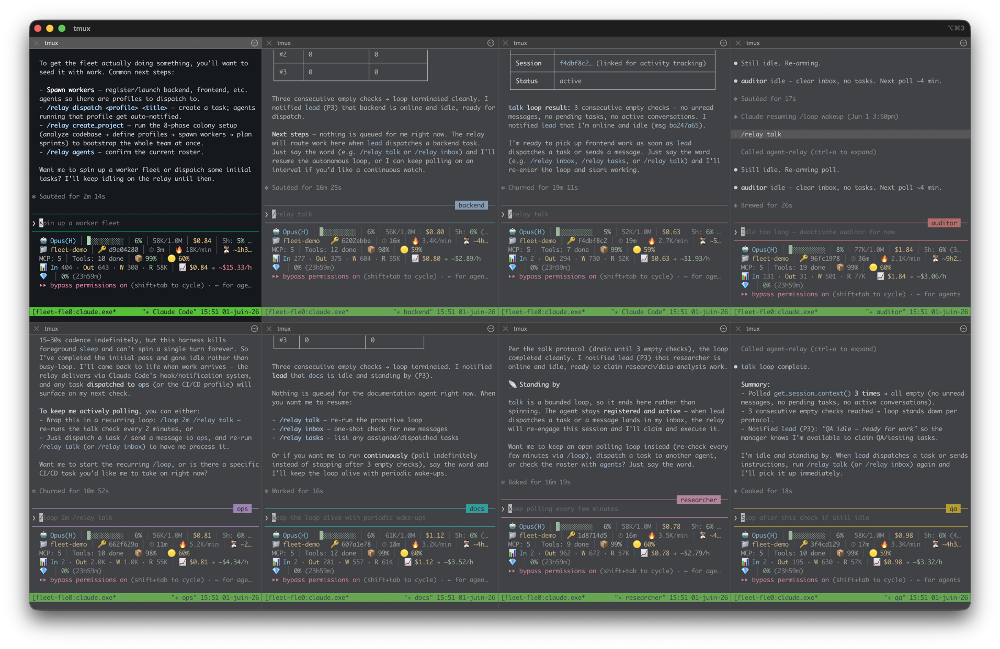

# fleet

**Launch and orchestrate multi-agent Claude Code fleets from one command.**

`fleet` is a Go CLI and TUI that spins up a team of Claude Code agents, each in its own tmux session, lays them out in an iTerm2 grid, and coordinates them through the [wrai.th](https://wrai.th) MCP relay. One operator drives many agents: dispatch a task to any agent, stream its terminal, add or stop workers on the fly.



```bash
fleet                          # interactive wizard: pick a project, a team, launch
fleet dispatch "fix the failing auth test" --to auditor
fleet logs dev -f              # follow an agent's terminal
fleet --status                 # relay-backed status: sessions, registration, task counts
```

## Why

Running a fleet of always-on agents is expensive. Agents that poll for work every 30 seconds burn tokens around the clock even when there is nothing to do: roughly **2.88M tokens per idle agent per day**, about **17M tokens/day for a team of six**.

fleet treats tokens as the scarce resource:

- Agents boot **registered but idle**: the tmux session is live and Claude is ready, but no polling loop runs. **Idle cost: zero tokens.**
- fleet **registers each agent server-side** at launch (full identity: role, `profile_slug`, reporting line). Agents never self-register in their pane, so they can't accidentally wipe their own `profile_slug` — task routing keeps working regardless of relay version. Identity travels with the wake instead.
- fleet **wakes an agent on dispatch**. The talk loop starts only when there is a task, then dies on its own after a few empty checks.
- Net effect: agents spend tokens while working, not while waiting. About **95% saved on idle token cost.**

## Features

- **Interactive wizard** (Bubble Tea TUI): pick a project, point at a path, confirm the relay URL (validated on the spot, defaults to the local relay), pick a team, launch.
- **Stack scanner**: detects the project's tech stack and suggests matching agent roles.
- **7 team presets**: Web App, API / Backend, Data / ML, Trading Bot, Full Stack, Minimal, Custom. Each is a ready-made set of agents with roles and a reporting structure.
- **tmux session per agent**, opened together in an **iTerm2 grid** (falls back to `tmux attach`).
- **Task dispatch + wake** in one step, routed through the relay.
- **Live logs**: stream any agent's pane, follow mode polls once a second.
- **Runtime fleet management**: `add` and `stop` agents without restarting the team.
- **Doctor**: checks tmux, the Claude Code CLI, iTerm2, and the relay, with install hints.
- **Persistent config**: every launch is saved as TOML, relaunch with `fleet --last`.

## Install

```bash
go install github.com/zairedegrees/fleet/cmd/fleet@latest
```

Or build from source:

```bash
git clone https://github.com/zairedegrees/fleet
cd fleet
go build -o fleet ./cmd/fleet
```

### Onboarding skill

If you use Claude Code, install the bundled `/fleet` skill — it drives the whole first-run setup (prerequisites, relay, a tailored team, launch):

```bash
ln -s "$(pwd)/skill/fleet" ~/.claude/skills/fleet
```

Then in Claude Code say "set up fleet for this project" (or `/fleet`) and it walks you from zero to a running, registered fleet.

## Requirements

Run `fleet --doctor` to verify and get install hints.

| Tool | Purpose | Install |
| --- | --- | --- |
| tmux | one session per agent | `brew install tmux` |
| Claude Code CLI | the agents themselves | `npm install -g @anthropic-ai/claude-code` |
| iTerm2 | grid layout (optional, falls back to tmux) | `brew install --cask iterm2` |
| wrai.th relay | agent registry, profiles, task dispatch | running at `http://localhost:8090/mcp` |

## Usage

```bash
fleet                         # interactive wizard
fleet --last                  # relaunch the last saved fleet
fleet --status                # sessions + relay state and task counts per agent
fleet usage                   # per-project usage: agents, polling, tasks, vault
fleet --kill                  # stop the last project's fleet
fleet --kill-all              # stop every fleet across all projects (asks y/N)
fleet --doctor                # check prerequisites
fleet --relay-url <url>       # override the relay URL for any command

fleet dispatch <task> --to <agent>     # dispatch a task and wake the agent
fleet logs <agent> [-n 50] [-f]        # stream an agent's terminal
fleet add --name qa --role "Testing" --reports-to dev
fleet stop <agent>                     # graceful /exit, then kill if needed
```

`fleet --kill-all` stops every project's sessions, so it asks for a `y/N` confirmation first; pass `--force` to skip the prompt in scripts. `--relay-url` works on every command and beats the project's saved `relay_url`, which beats the built-in default (`http://localhost:8090/mcp`).

`fleet --status` uses the relay as the source of truth: each tmux session shows its relay registration and workload (`[relay: active · 2 task(s)]`), sessions the relay does not know show `[relay: unregistered]`, and relay-registered agents without a session appear as ghosts (`no tmux session`). If the relay is down, status degrades to a `⚠ relay unavailable` warning followed by the tmux sessions only.

## Architecture

```
cmd/fleet            cobra CLI: wizard, dispatch, logs, add, stop, usage, lifecycle flags
internal/wizard      Bubble Tea TUI: project panel, agent panel, presets, drawer
internal/scanner     tech-stack detection, agent suggestions
internal/runner      tmux session management, iTerm2 grid, async agent configuration
internal/relay       wrai.th MCP HTTP client (list, dispatch, profiles, vault)
internal/config      TOML config, validation, last-run persistence
internal/doctor      prerequisite checks with install hints
```

Sessions are named `fleet-<project>-<agent>`, so multiple projects can run side by side. Config lives in `~/.fleet/configs/<project>.toml`.

**Registration is server-side, never in-pane.** At launch fleet registers every agent on the relay with its full identity (role, `profile_slug`, reporting line) over HTTP — `profile_slug` is what routes dispatched tasks. Agents are never told to `/relay register` themselves, because a bare self-register omits `profile_slug` and an older relay's full-replace UPDATE would NULL it, silently breaking task routing. Instead, identity rides along with each wake: just before `/relay talk`, fleet sends the agent a one-line preamble stating who it is and instructing it not to call `register_agent`. Task routing therefore works against any relay version.

Recommended (defense-in-depth, not required): run the [wrai.th](https://wrai.th) relay with **preserve-omitted re-registration**, so even an accidental bare re-register keeps the existing `profile_slug` instead of clearing it.

Built with [Cobra](https://github.com/spf13/cobra) and [Charm Bubble Tea](https://github.com/charmbracelet/bubbletea).

## Configuration

Every launch is saved to `~/.fleet/configs/<project>.toml` and relaunched with `fleet --last`. fleet locates your Claude Code binary automatically (it resolves the absolute path of `claude` from your environment, so the agent shells do not need it on their own PATH). To pin a specific binary, set it in the config:

```toml
[claude]
bin = "~/.local/bin/claude"          # optional, defaults to "claude" on your PATH
flags = ["--dangerously-skip-permissions"]
```

## Status

Early but used daily. The CLI surface and the token-aware launch model are stable; expect the wizard and presets to keep evolving.

## License

See [LICENSE](LICENSE).
